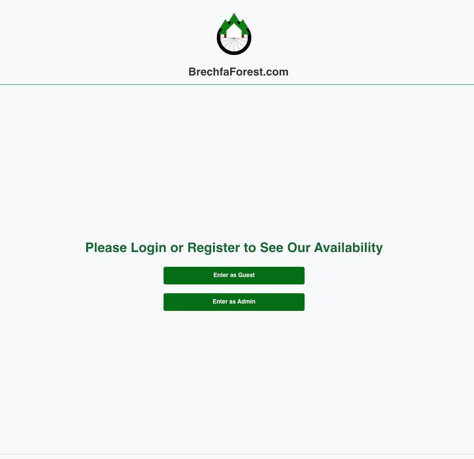

# react-node-booking-app

## Full-Stack Booking System

### Project Overview
A full‑stack booking system built with React, Node.js, Express, and MySQL. It features secure JWT authentication, a modular API, and a responsive UI for managing bookings. Designed for a real cottage business, it demonstrates clean architecture, practical problem‑solving, and scalable development.

---

## Folder Structure
/backend - Express API (Node.js + MySQL) 
/frontend - React application (React + React Router DOM)

---
## How to Run the Project

### Backend (API Server)
1. Navigate to the backend folder:  
   `cd backend`
2. Install dependencies:  
   `npm install`
3. Start the backend server:  
   `npm run dev`

Backend runs on: **http://localhost:5001**

---
### Frontend (React App)
1. Navigate to the frontend folder:  
   `cd frontend`
2. Install dependencies:  
   `npm install`
3. Start the frontend:  
   `npm start`

Frontend runs on: **http://localhost:3000**  
Login page (React Router DOM): **http://localhost:3000/loginPage**

---
## Screenshots

### Login Page

### Date Selection

---
## API Endpoints

| Method | Endpoint         | Description                  |
|--------|------------------|------------------------------|
| GET    | `/test`          | Checks if API is running     |
| POST   | `/bookings`      | Creates a new booking        |
| GET    | `/bookings/:id`  | Retrieves a booking by ID    |

---
## Environment Variables (`.env`)

Create a `.env` file inside `/backend` with:
DB_HOST=your-database-host 
DB_USER=your-database-username 
DB_PASS=your-database-password

Ensure `.env` is included in `.gitignore` to keep credentials private.

---
## Project Status
This project is a work in progress. Current features include backend API structure, authentication logic, and initial frontend routing. Upcoming features include host management tools, full booking workflows, and deployment.

---
## Version Control Notes

Your `.gitignore` should include:
/node_modules 
/.env *.sql 
/build

---
## Standard Workflow
git add . 
git commit -m "Update project" 
git push origin main
